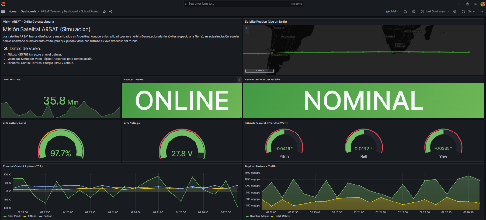
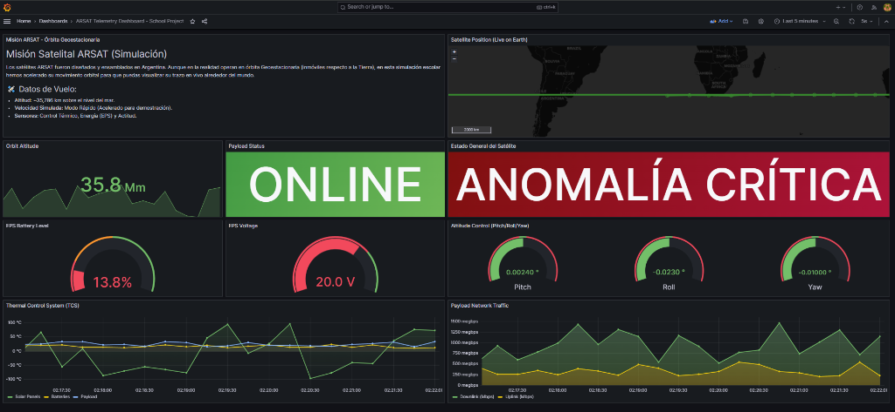
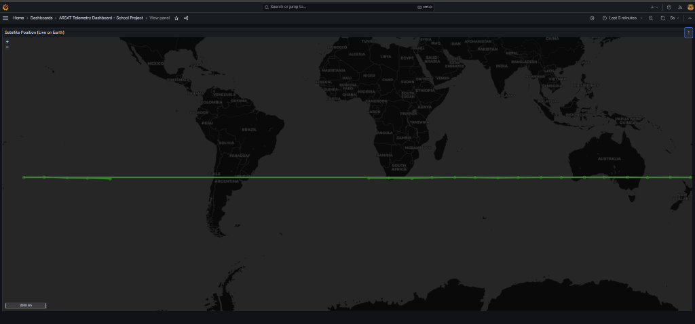
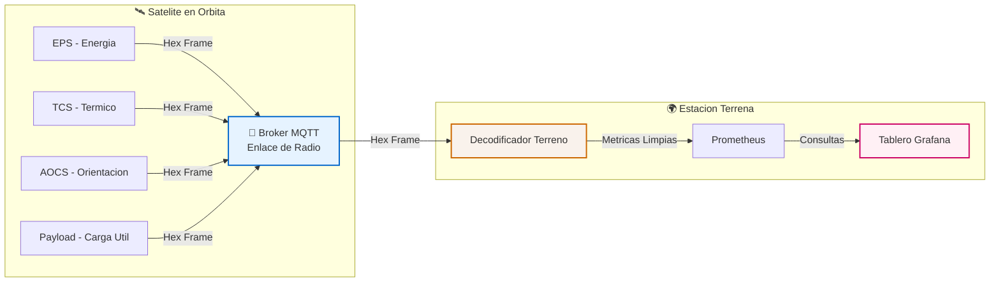

<div align="center">
  <h1>🛰️ Simulador de Telemetría Satelital ARSAT</h1>
  <p><i>Un proyecto educativo simulando la arquitectura de telemetría, comunicaciones y observabilidad de un satélite geoestacionario.</i></p>
  
  
  
  
  
  
</div>

<br>

<details open>
  <summary><b>📸 Galería del Centro de Control (Haz clic para ver más)</b></summary>
  
  <p align="center">
    <i>1. Estado Nominal (Todos los sistemas funcionando correctamente)</i><br>
    
  </p>
  
  <p align="center">
    <i>2. Alarma de Batería (Simulación de caída de tensión inyectada)</i><br>
    
  </p>

  <p align="center">
    <i>3. Rastreo Orbital en Vivo (Movimiento satelital sobre mapa terrestre)</i><br>
    
  </p>
</details>

---

## 📖 Sobre el Proyecto

Este proyecto es un entorno de simulación autónomo diseñado para fines educativos. Replica el ciclo de vida completo de la telemetría espacial: desde que los sensores a bordo del satélite capturan datos en órbita, hasta su recepción, decodificación y visualización en tiempo real en una estación terrena.

Se utiliza una arquitectura moderna de **microservicios orientados a eventos (Pub/Sub)**, garantizando que el entorno sea extremadamente ligero y capaz de ejecutarse en equipos de bajos recursos.

### ✨ Características Principales
- **Simulación Realista de Fallas:** El sistema inyecta anomalías controladas periódicamente (caídas de tensión, alto consumo) para entrenar la respuesta del centro de control.
- **Rastreo Orbital en Vivo:** Utiliza las capacidades de Geomap de Grafana para trazar la órbita simulada del satélite en tiempo real sobre un mapa mundial.
- **Empaquetado de Datos:** Simula tramas de telemetría reales, empaquetando datos numéricos en tramas hexadecimales (ej. `0x41E00000...`) antes de su transmisión espacial.
- **Panel de Control Dinámico:** Un dashboard "Mission Control" que evalúa matemáticamente el estado de todos los sistemas en tiempo real, cambiando alertas visuales instantáneas ante anomalías.

---

## 📐 Arquitectura del Sistema

El flujo de información se divide en tres grandes bloques simulados:



1. **El Satélite (Productores):** Cuatro microservicios independientes en Python que generan lecturas físicas (batería, temperatura, actitud) y publican tramas binarias.
2. **El Enlace Espacial (Broker MQTT):** Mosquitto actúa como el canal de radio, distribuyendo las tramas empaquetadas.
3. **El Centro de Control (Consumidores):** La *Ground Station* se suscribe, decodifica los datos a formato humano y los expone. Prometheus almacena la base temporal y Grafana renderiza los tableros.

---

## 🚀 Inicio Rápido

Toda la infraestructura está dockerizada (Alpine Linux) para asegurar compatibilidad universal y bajísimo consumo de RAM. 

### Usuarios de Windows
Simplemente haz doble clic en el archivo `iniciar_simulacion.bat`. Este script verificará que Docker esté funcionando, construirá los servicios y abrirá automáticamente el navegador en el panel de control.

### Usuarios de Linux / Debian
Abre tu terminal en la carpeta del proyecto y ejecuta el script automatizado:
```bash
chmod +x deploy_debian.sh
sudo ./deploy_debian.sh
```

### Ejecución Manual (Cualquier SO)
Asegúrate de tener Docker y Docker Compose instalados, y ejecuta:
```bash
docker compose down && docker compose up -d --build
```

---

## 🎮 Interfaz de Monitoreo

Una vez que el sistema esté levantado, puedes acceder a las herramientas del centro de control:

- **Dashboard Principal (Grafana):** [http://localhost:3000](http://localhost:3000) *(Usuario: `admin` / Clave: `admin`)*
- **Base de Datos (Prometheus):** [http://localhost:9090](http://localhost:9090)

### 💡 Tips para la Demostración
- Asegúrate de que el tablero en Grafana esté configurado para mostrar los **"Last 5 minutes"** y con **Auto-refresh en 5s**.
- Observa el panel gigante superior derecho. Cuando la simulación inyecte una falla en las baterías, el cartel pasará instantáneamente de color verde (**NOMINAL**) a rojo profundo (**ANOMALÍA CRÍTICA**), volviendo a la normalidad cuando la falla se despeje.
- El almacenamiento de Prometheus está optimizado en `docker-compose.yml` para retener solo 2 horas de datos (o 100MB), evitando que sature el disco duro en ejecuciones largas.

---

<div align="center">
  <i>Desarrollado como proyecto de demostración técnica y educativa.</i>
</div>
